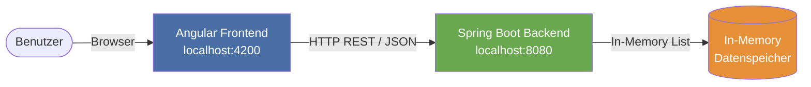
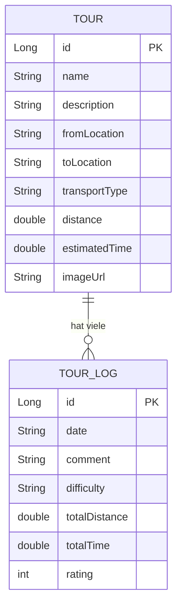
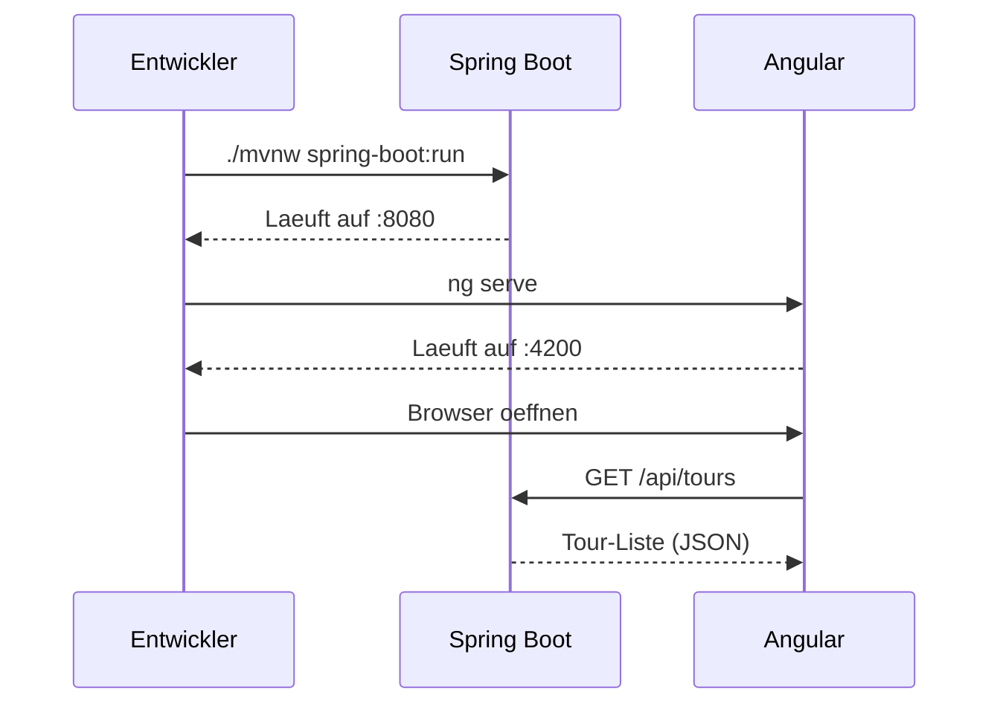

# Tour Planner - Technische Dokumentation

**Projekt:** Tour Planner  
**Team:** Team 9 - FH Technikum Wien  
**Stand:** April 2026  
**Stack:** Angular 17 (Frontend) | Spring Boot 3 (Backend) | In-Memory Datenspeicher

---

## Inhaltsverzeichnis

1. [Projektuebersicht](#1-projektuebersicht)
2. [Systemarchitektur](#2-systemarchitektur)
3. [Projektstruktur](#3-projektstruktur)
4. [Datenmodell](#4-datenmodell)
5. [Backend - Spring Boot](#5-backend--spring-boot)
6. [Frontend - Angular](#6-frontend--angular)
7. [API-Dokumentation](#7-api-dokumentation)
8. [Datenmapping Frontend und Backend](#8-datenmapping-frontend-und-backend)
9. [Validierung](#9-validierung)
10. [Setup und Starten](#10-setup-und-starten)
11. [Bekannte Einschraenkungen und offene Punkte](#11-bekannte-einschraenkungen-und-offene-punkte)

---

## 1. Projektuebersicht

Der Tour Planner ist eine Fullstack-Webanwendung. Nutzer koennen damit Touren anlegen, verwalten und dokumentieren. Zu jeder Tour koennen beliebig viele Tour Logs (Reiseprotokolle) erfasst werden.

### Kernfunktionen

| Funktion | Beschreibung |
|---|---|
| Tour anlegen | Neue Tour mit allen Pflichtfeldern erstellen |
| Tour bearbeiten | Name, Beschreibung, Strecke, Transport, Distanz usw. aendern |
| Tour loeschen | Tour inklusive aller Logs entfernen |
| Log hinzufuegen | Reiseprotokoll zu einer Tour hinzufuegen |
| Log bearbeiten | Datum, Kommentar, Schwierigkeit, Distanz, Zeit, Bewertung aendern |
| Log loeschen | Einzelnes Log einer Tour loeschen |

---

## 2. Systemarchitektur



**Kommunikation:**
- Frontend zu Backend: REST ueber HttpClient (Angular)
- CORS ist fuer http://localhost:4200 konfiguriert
- Datenaustausch: JSON
- Kein persistenter Datenspeicher (In-Memory, Daten gehen beim Neustart verloren)

---

## 3. Projektstruktur

```
Team9/
├── backend/                        # Spring Boot Anwendung
│   └── src/main/java/at/fhtw/backend/
│       ├── BackendApplication.java         # Einstiegspunkt
│       ├── config/
│       │   └── CorsConfig.java             # CORS-Konfiguration
│       ├── controller/
│       │   ├── TourController.java         # REST-Endpunkte fuer Touren und Logs
│       │   └── TourLogController.java      # REST-Endpunkte fuer Logs direkt
│       ├── model/
│       │   ├── Tour.java                   # Tour-Datenklasse
│       │   └── TourLog.java                # TourLog-Datenklasse
│       └── service/
│           └── TourService.java            # Business-Logik und Datenhaltung
│
└── frontend/                       # Angular Anwendung
    └── src/app/
        ├── app.component.ts                # Haupt-Komponente (Controller)
        ├── app.component.html              # Haupt-Template (View)
        ├── app.component.scss              # Styles
        ├── app.routes.ts                   # Routing (aktuell leer)
        ├── tour.service.ts                 # HTTP-Service plus Datenmapping
        ├── models/
        │   ├── tour.model.ts               # Tour Interface (Frontend)
        │   └── tour-log.model.ts           # TourLog Interface (Frontend)
        └── components/
            └── tour-log-card/
                └── tour-log-card.component.ts  # Log-Karten-Komponente
```

---

## 4. Datenmodell



### Tour - Felduebersicht

| Feld | Typ | Pflicht | Beschreibung |
|---|---|---|---|
| id | Long | auto | Eindeutige ID (auto-increment) |
| name | String | ja | Name der Tour |
| description | String | nein | Beschreibung |
| fromLocation | String | ja | Startort |
| toLocation | String | ja | Zielort |
| transportType | String | nein | z. B. Walking, Bicycle, Car |
| distance | double | ja (>= 0) | Distanz in km |
| estimatedTime | double | ja | Geschaetzte Zeit in Stunden |
| imageUrl | String | nein | URL zum Tourenbild |
| logs | List<TourLog> | nein | Liste der Reiseprotokolle |

### TourLog - Felduebersicht

| Feld | Typ | Pflicht | Beschreibung |
|---|---|---|---|
| id | Long | auto | Eindeutige ID |
| date | String | nein | Datum (ISO: YYYY-MM-DD) |
| comment | String | ja | Kommentar zum Erlebnis |
| difficulty | String | ja | Very Easy / Easy / Medium / Hard / Very Hard |
| totalDistance | double | ja (>= 0) | Tatsaechlich zurueckgelegte Distanz in km |
| totalTime | double | ja (>= 0) | Tatsaechlich benoetigte Zeit in Stunden |
| rating | int | ja (1 bis 5) | Bewertung der Tour |

---

## 5. Backend - Spring Boot

### 5.1 Einstiegspunkt

BackendApplication.java - Standard Spring Boot Main-Klasse, startet den Tomcat-Server auf Port 8080.

### 5.2 CORS-Konfiguration

CorsConfig.java erlaubt Anfragen vom Angular-Frontend:

```java
registry.addMapping("/api/**")
    .allowedOrigins("http://localhost:4200")
    .allowedMethods("GET", "POST", "PUT", "DELETE", "OPTIONS");
```

### 5.3 TourService - Business-Logik

Der TourService ist der zentrale Datenspeicher. Daten werden im RAM gehalten (List<Tour>). Beim Start werden via @PostConstruct zwei Beispieltouren angelegt:

| Tour | Von zu Nach | Transport |
|---|---|---|
| Vienna City Tour | Stephansplatz zu Schoenbrunn | Walking |
| Danube Bike Ride | Donauinsel zu Klosterneuburg | Bicycle |

**Methoden:**

| Methode | Beschreibung |
|---|---|
| getAllTours() | Alle Touren zurueckgeben |
| getTourById(id) | Tour per ID suchen |
| createTour(tour) | Tour anlegen, ID vergeben |
| updateTour(id, tour) | Tour-Felder aktualisieren (Logs bleiben erhalten) |
| deleteTour(id) | Tour aus Liste entfernen |
| getLogsByTourId(tourId) | Alle Logs einer Tour |
| addLogToTour(tourId, log) | Log zu Tour hinzufuegen |
| updateLog(logId, log) | Log-Felder aktualisieren |
| deleteLog(logId) | Log aus Tour entfernen |

### 5.4 TourController

@RestController unter /api/tours. Delegiert alle Aufrufe an den TourService.

---

## 6. Frontend - Angular

### 6.1 AppComponent

Die AppComponent ist die einzige Seite der Anwendung (Single-Page). Sie enthaelt:

- Linkes Panel: Tour-Liste plus Add Tour-Button
- Rechtes Panel: Tour-Details, Edit-Formular, Log-Liste

**Wichtige Methoden:**

| Methode | Beschreibung |
|---|---|
| ngOnInit() | Touren beim Start laden |
| loadTours() | Alle Touren vom Backend abrufen, selectedTour aktualisieren |
| addTour() | Neue Tour mit Standardwerten anlegen |
| saveTour() | Aktuell ausgewaehlte Tour speichern (nach Validierung) |
| deleteSelectedTour() | Ausgewaehlte Tour loeschen |
| addLog() | Neues Log zur aktuellen Tour hinzufuegen |
| saveLog(log) | Log speichern (nach Validierung) |
| deleteLog(logId) | Log loeschen |

### 6.2 TourService (Angular)

Verantwortlich fuer:
1. HTTP-Kommunikation mit dem Backend
2. Datenmapping zwischen Frontend- und Backend-Format

**Base URLs:**
```typescript
private readonly baseUrl        = 'http://localhost:8080/api/tours';
private readonly tourLogBaseUrl = 'http://localhost:8080/api/tour-logs';
```

### 6.3 TourLogCard-Komponente

Eigenstaendige Komponente zur Anzeige und Bearbeitung eines einzelnen Logs.

**Inputs/Outputs:**
- @Input() log: TourLog - das anzuzeigende Log
- @Output() deleteRequested - Event beim Klick auf Loeschen
- @Output() saveRequested - Event beim Klick auf Speichern

---

## 7. API-Dokumentation

### Tours

| Methode | Endpoint | Beschreibung | Response |
|---|---|---|---|
| GET | /api/tours | Alle Touren abrufen | 200 OK - Tour[] |
| GET | /api/tours/{id} | Tour per ID | 200 OK / 404 Not Found |
| POST | /api/tours | Neue Tour erstellen | 200 OK - Tour |
| PUT | /api/tours/{id} | Tour aktualisieren | 200 OK / 404 Not Found |
| DELETE | /api/tours/{id} | Tour loeschen | 204 No Content / 404 Not Found |

### Tour Logs

| Methode | Endpoint | Beschreibung | Response |
|---|---|---|---|
| GET | /api/tours/{id}/logs | Alle Logs einer Tour | 200 OK - TourLog[] |
| POST | /api/tours/{id}/logs | Neues Log anlegen | 200 OK - TourLog |
| PUT | /api/tour-logs/{logId} | Log aktualisieren | 200 OK - TourLog |
| DELETE | /api/tour-logs/{logId} | Log loeschen | 204 No Content |

### Beispiel - Tour anlegen (POST /api/tours)

**Request Body:**
```json
{
  "name": "Wien Radtour",
  "description": "Schoene Radtour durch Wien",
  "fromLocation": "Praterstern",
  "toLocation": "Schoenbrunn",
  "transportType": "Bicycle",
  "distance": 12.5,
  "estimatedTime": 1.5,
  "imageUrl": "https://example.com/wien.jpg",
  "logs": []
}
```

**Response:**
```json
{
  "id": 3,
  "name": "Wien Radtour",
  "fromLocation": "Praterstern",
  "toLocation": "Schoenbrunn",
  "transportType": "Bicycle",
  "distance": 12.5,
  "estimatedTime": 1.5,
  "logs": []
}
```

---

## 8. Datenmapping Frontend und Backend

Da Frontend und Backend unterschiedliche Feldnamen und -typen verwenden, fuehrt der TourService eine Konvertierung durch:

### Tour-Mapping

| Frontend (Tour) | Backend (BackendTour) | Unterschied |
|---|---|---|
| from | fromLocation | Umbenennung |
| to | toLocation | Umbenennung |
| estimatedTime: string | estimatedTime: number | String "3h 10min" zu Dezimalzahl 3.167 |

### TourLog-Mapping

| Frontend (TourLog) | Backend (BackendTourLog) | Unterschied |
|---|---|---|
| dateTime: string | date: string | Enthaelt Zeit (ISO) zu nur Datum |
| difficulty: number | difficulty: string | 3 zu "Medium" |
| totalTime: number (Minuten) | totalTime: number (Stunden) | Umrechnung mal 60 |

### Schwierigkeits-Mapping

| Zahl (Frontend) | Text (Backend) |
|---|---|
| 1 | Very Easy |
| 2 | Easy |
| 3 | Medium |
| 4 | Hard |
| 5 | Very Hard |

---

## 9. Validierung

Validierung findet ausschliesslich im Frontend statt. Felder mit Fehler werden rot markiert.

### Tour-Validierung

| Feld | Regel | Fehlermeldung |
|---|---|---|
| name | Nicht leer | Name must not be empty |
| from | Nicht leer | Start location must not be empty |
| to | Nicht leer | Destination must not be empty |
| distance | >= 0 | Distance must be 0 or greater |
| estimatedTime | Nicht leer | Estimated time must not be empty |

### Log-Validierung

| Feld | Regel |
|---|---|
| comment | Nicht leer |
| difficulty | >= 0 |
| totalDistance | >= 0 |
| totalTime | >= 0 |
| rating | 1 bis 5 |

---

## 10. Setup und Starten

### Voraussetzungen

| Tool | Version |
|---|---|
| Java | 17 plus |
| Maven | 3.8 plus (oder ./mvnw) |
| Node.js | 18 plus |
| Angular CLI | 17 plus |

### Backend starten

```bash
cd backend
./mvnw spring-boot:run
```

Backend laeuft auf http://localhost:8080

### Frontend starten

```bash
cd frontend
npm install
ng serve
```

Frontend laeuft auf http://localhost:4200

### Reihenfolge



---

## 11. Bekannte Einschraenkungen und offene Punkte

| Nummer | Thema | Beschreibung |
|---|---|---|
| 1 | Kein persistenter Speicher | Daten gehen beim Backend-Neustart verloren. Noch keine Datenbank (z. B. PostgreSQL) angebunden. |
| 2 | Kein Routing | app.routes.ts ist leer - alle Views befinden sich in einer einzigen Komponente. |
| 3 | Keine Kartenintegration | Der Karten-Platzhalter (Map placeholder) ist noch nicht mit OpenLayers / Leaflet befuellt. |
| 4 | Keine Authentifizierung | Kein Login / keine Benutzerverwaltung vorhanden. |
| 5 | Keine Backend-Validierung | Validierung findet nur im Frontend statt; das Backend nimmt alle Eingaben ungeprueft an. |
| 6 | CORS nur fuer localhost | Produktivbetrieb erfordert angepasste CORS-Konfiguration. |
