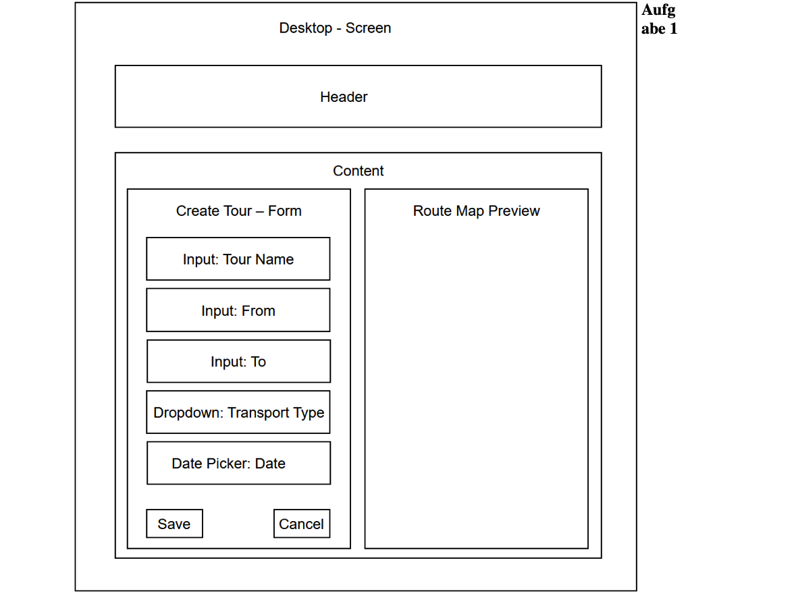
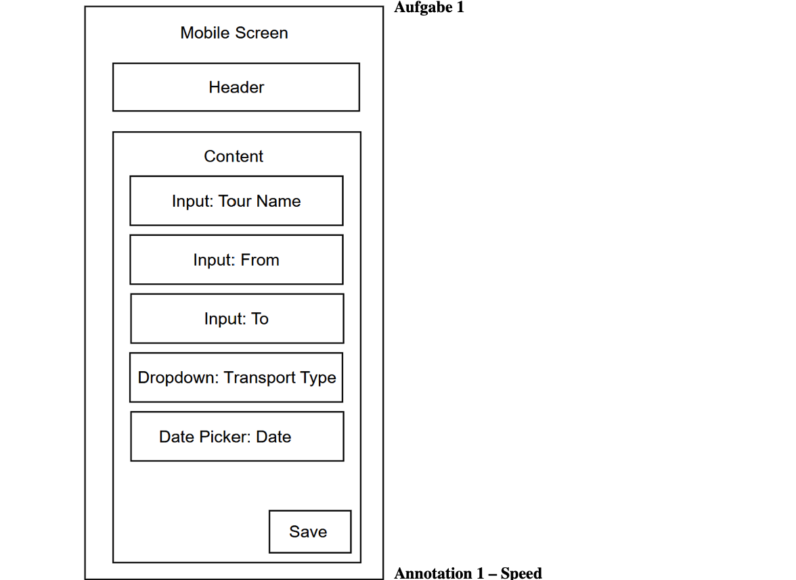

## 1. Wireframes (UI Work)

Wir haben den Screen "Tour-Details" für den TourPlanner entworfen.

### Variante A: Desktop (Fokus: Übersicht/Clarity)


### Variante B: Mobile (Fokus: Einhandbedienung/Speed)


**Layout-Entscheidungen:**
1. **Hierarchische Ansicht (Desktop):** Auf dem Desktop werden Tour-Beschreibung und Karte nebeneinander angezeigt, um den Platz für maximale Übersicht zu nutzen.
2. **Bottom-Action-Bar (Mobile):** Der "Start Tour"-Button ist am unteren Bildschirmrand fixiert, damit er mit dem Daumen sofort erreichbar ist.
3. **Progressive Disclosure:** Details wie Wetterdaten oder Höhenprofile sind auf Mobile hinter einem Tab versteckt, um den Screen nicht zu überladen.

---

## 3. Kanban-Board & Projektmanagement

Das UI-Feature "Interaktive Karte" wird über unser GitHub Project Board gesteuert.

| Task ID | Task | Priorität | Owner | Status |
| :--- | :--- | :--- | :--- | :--- |
| **TP-101** | UI: Low-Fi Wireframes für Map-Ansicht erstellen | Hoch | Alex | Done |
| **TP-102** | Tech: OpenRouteService API Integration | Hoch | Sam | In Progress |
| **TP-103** | UI: Map-Komponente in React implementieren | Mittel | Jamie | To Do |
| **TP-104** | UI: Responsives Layout für Mobile optimieren | Mittel | Alex | To Do |
| **TP-105** | Test: Unit-Tests für Routen-Berechnung | Niedrig | Sam | To Do |
| **TP-106** | Review: Code-Review der Map-Integration | Mittel | Jamie | To Do |

**Beispiel-Task Detail (TP-103):**
* **Bezug:** Siehe Wireframes in `design/wireframes_v1.png`.
* **Acceptance Criterion:** Die Karte muss die Route basierend auf den GPS-Daten der `RouteData`-Klasse innerhalb von weniger als 2 Sekunden flüssig rendern.


# TourPlanner - Projekt Dokumentation

Dieses Repository enthält die Planung und Umsetzung der TourPlanner App.

---

## 1. UML Diagrams

### Use Case Diagram
Das Diagramm zeigt die Interaktionen zwischen dem User und dem System sowie die Anbindung der Routen-API.

```mermaid
graph LR
    User((User))
    API[OpenRouteService API]

    subgraph "Tour Planner System"
        UC1(Self Register)
        UC2(Login)
        UC3(Manage Tours)
        UC4(Retrieve Route Data)
        UC5(Manage Tour Logs)
        UC6(Search Data)
        UC7(Import/Export)
    end

    User --- UC1
    User --- UC2
    User --- UC3
    User --- UC5
    User --- UC6
    User --- UC7

    UC3 -.->|include| UC4
    UC4 --- API
