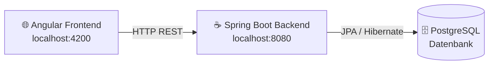
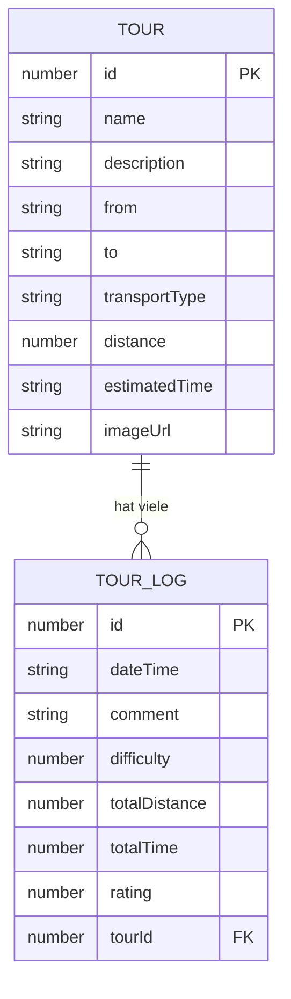
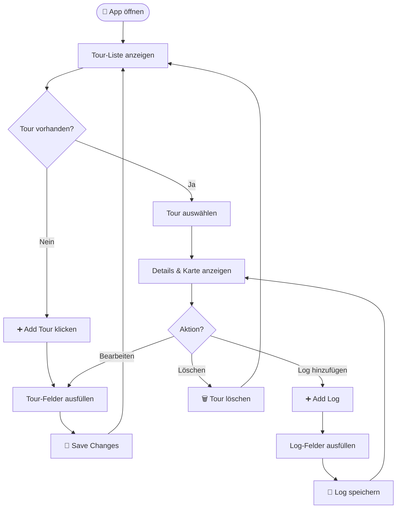
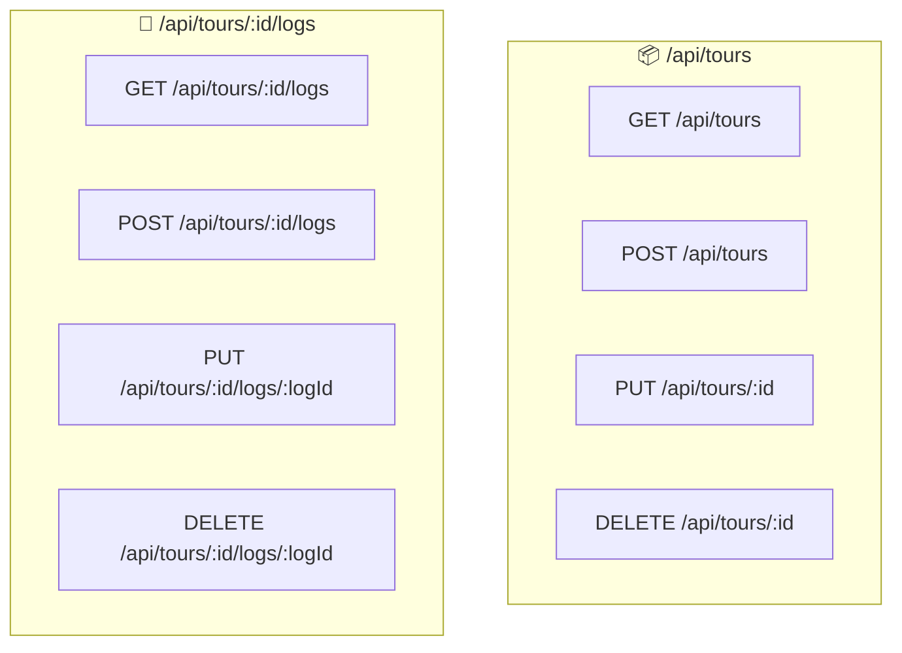
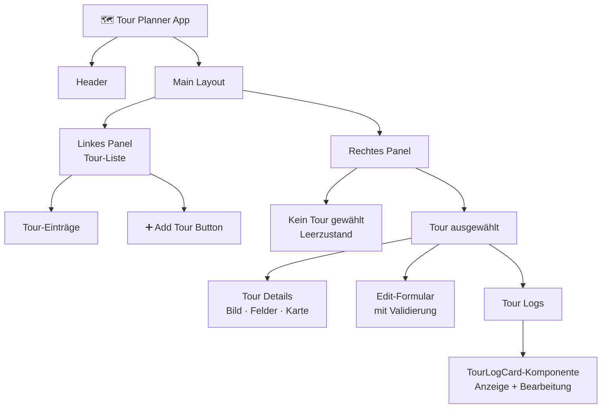

# 🗺️ Tour Planner

Eine Fullstack-Webanwendung zur Verwaltung von Touren und Reiseprotokollen.  
**Frontend:** Angular · **Backend:** Spring Boot · **Datenbank:** PostgreSQL

---

## 🏗️ Architektur



---

## 🗃️ Datenmodell



---

## 🔄 User Flow



---

## 🔌 REST API Endpunkte



---

## 🖥️ UI-Struktur



---

## 🚀 Setup & Starten

### Backend (Spring Boot)
```bash
cd backend
./mvnw spring-boot:run
```

### Frontend (Angular)
```bash
cd frontend
npm install
ng serve
```

App läuft unter **http://localhost:4200**
