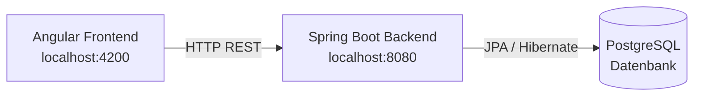
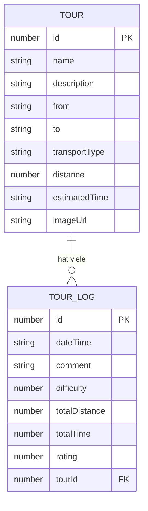
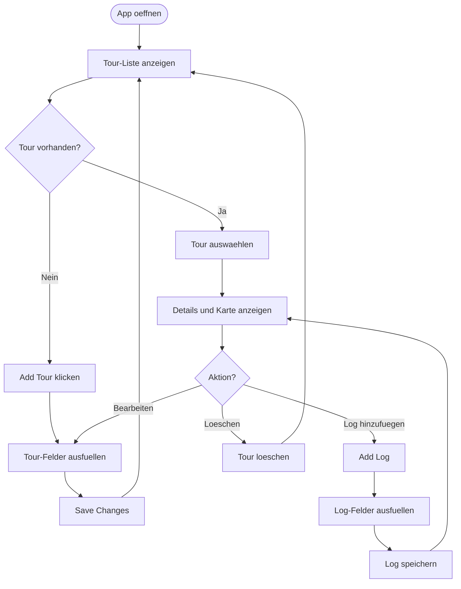

# Tour Planner

Re-upload: Repository wurde versehentlich geloescht beim Wechseln von Branches.

Eine Fullstack-Webanwendung zur Verwaltung von Touren und Reiseprotokollen.  
**Frontend:** Angular | **Backend:** Spring Boot | **Datenbank:** PostgreSQL

---

## Wireframe - Gesamtstruktur der Anwendung

```
+------------------------------------------------------------------+
|                        Tour Planner Header                        |
+------------------------------------------------------------------+
|                                                                  |
|  +-------------------------+  +-------------------------------+  |
|  |                         |  |                               |  |
|  |   Tour Liste            |  |   Tour Details                |  |
|  |                         |  |                               |  |
|  |  [ ] Tour 1             |  |   Name: Vienna City Tour      |  |
|  |  [x] Tour 2  (selected) |  |   Von: Stephansplatz          |  |
|  |  [ ] Tour 3             |  |   Nach: Schoenbrunn           |  |
|  |                         |  |   Transport: Walking          |  |
|  |  [+ Add Tour]           |  |   Distanz: 5.2 km             |  |
|  |                         |  |   Zeit: 1.5 h                 |  |
|  |                         |  |                               |  |
|  |                         |  |   +-------------------------+ |  |
|  |                         |  |   |   Karte Placeholder     | |  |
|  |                         |  |   |                         | |  |
|  |                         |  |   +-------------------------+ |  |
|  |                         |  |                               |  |
|  |                         |  |   [Edit] [Delete] [Save]      |  |
|  |                         |  |                               |  |
|  |                         |  |   --- Tour Logs ---           |  |
|  |                         |  |                               |  |
|  |                         |  |   Log 1:                      |  |
|  |                         |  |   - Datum: 2026-03-15         |  |
|  |                         |  |   - Schwierigkeit: Medium     |  |
|  |                         |  |   - Bewertung: 4/5            |  |
|  |                         |  |   [Edit Log] [Delete Log]     |  |
|  |                         |  |                               |  |
|  |                         |  |   [+ Add Log]                 |  |
|  |                         |  |                               |  |
|  +-------------------------+  +-------------------------------+  |
|                                                                  |
+------------------------------------------------------------------+
```

---

## Architektur



---

## Datenmodell



---

## Benutzerablauf



---

## REST API Endpunkte

### Authentifizierung
- `POST /api/auth/register` - Benutzer registrieren
- `POST /api/auth/login` - Benutzer anmelden

### Touren
- `GET /api/tours` - Alle Touren abrufen
- `POST /api/tours` - Neue Tour erstellen
- `PUT /api/tours/{id}` - Tour aktualisieren
- `DELETE /api/tours/{id}` - Tour loeschen

### Tour Logs
- `GET /api/tours/{id}/logs` - Alle Logs einer Tour
- `POST /api/tours/{id}/logs` - Neues Log erstellen
- `PUT /api/tour-logs/{logId}` - Log aktualisieren
- `DELETE /api/tour-logs/{logId}` - Log loeschen

---

## Setup und Starten

### Backend starten (Spring Boot)
```bash
cd backend
./mvnw spring-boot:run
```

Windows:
```bash
cd backend
mvnw.cmd spring-boot:run
```

### Frontend starten (Angular)
```bash
cd frontend
npm install
ng serve
```

oder

```bash
cd frontend
npm install
npm start
```

Die Anwendung laeuft unter **http://localhost:4200**  
Das Backend laeuft unter **http://localhost:8080**

---

## Intermediate Hand-In Checkliste

### Erfuellte Anforderungen

**Must Haves**
- Angular als Frontend Framework verwendet
- MVVM Pattern fuer UI implementiert

**GUI Allgemein**
- Korrekte Datenbindung zwischen UI und View Model
- UI reagiert auf Fenstergroesse (responsive)
- Wiederverwendbare UI-Komponente definiert (TourLogCard)

**Touren**
- Erstellen, Bearbeiten, Loeschen von Touren
- Touren haben alle erforderlichen Attribute inkl. Bild
- Tour-Details zeigen alle Attribute und Karten-Platzhalter
- Eingabevalidierung verhindert Absturz bei falscher Eingabe

**Tour Logs**
- Erstellen, Bearbeiten, Loeschen von Tour Logs
- Logs haben alle erforderlichen Attribute
- Logs werden in Listenansicht mit allen Attributen angezeigt
- Eingabevalidierung implementiert

**Authentifizierung**
- Login und Registrierung mit JWT-Token
- Geschuetzte API-Endpunkte unter /api/**
- Oeffentliche Endpunkte unter /api/auth/**

---

## Projektstruktur

```
Team9/
├── backend/                 # Spring Boot Anwendung
│   └── src/main/java/at/fhtw/backend/
│       ├── BackendApplication.java
│       ├── config/
│       │   └── CorsConfig.java
│       ├── controller/
│       │   ├── AuthController.java
│       │   ├── TourController.java
│       │   └── TourLogController.java
│       ├── model/
│       │   ├── Tour.java
│       │   ├── TourLog.java
│       │   └── User.java
│       ├── dto/
│       └── service/
│           ├── TourService.java
│           └── AuthService.java
│
└── frontend/                # Angular Anwendung
    └── src/app/
        ├── app.component.ts
        ├── app.component.html
        ├── tour.service.ts
        ├── auth.service.ts
        ├── models/
        │   ├── tour.model.ts
        │   ├── tour-log.model.ts
        │   └── auth.model.ts
        └── components/
            └── tour-log-card/
```

---

## Hinweis

Dieses Repository wurde neu hochgeladen, nachdem es beim Branch-Wechsel versehentlich geloescht wurde.

Dokumentation siehe DOCUMENTATION.md fuer detaillierte technische Informationen.

